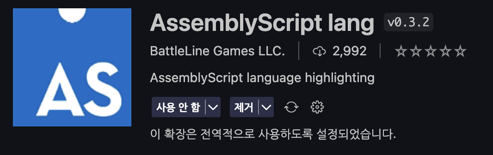

# WASM

## 환경 설정

webpack을 통한 설정

공식 문서: https://webpack.js.org/

assemblyscript live loader를 설치하고 추가하였다
```zsh
$ yarn add https://github.com/dongsik-yoo/assemblyscript-live-loader.git --dev
```

```js
 module: {
    rules: [
      {
        test: /\.asc$/, 
        exclude: '/node_modules/',
        use: 'assemblyscript-live-loader',
      },
      // 나머지 설정
    ],
  },
```

```ts
declare module '*.asc' {
  const content: any;
  export default content;
}
```
typescript에서 사용하기 위한 모듈 선언을 해준다



코드 하이라이터를 위한 확장 프로그램을 설치할 수 있다

```json
  "scripts": {
    "start": "webpack serve --open",
    "build": "webpack"
  },
```

`yarn start`로 개발 서버를 실행할 수 있다 (HMR 적용)

`yarn build`로 `docs` 디렉토리에 빌드된다. (github page에 배포되는 디렉토리)

---

### src/src/Calculator.asc
assemblyscript로 작성한 사칙연산과 팩토리얼
### src/ts/calculator.ts
typescript (컴파일 하면 자바스크립트와 동일하다)로 작성한 사칙연산과 팩토리얼
### src/ts/benchmark.ts
micro-benchmarck로 성능 측정을 하는 모듈